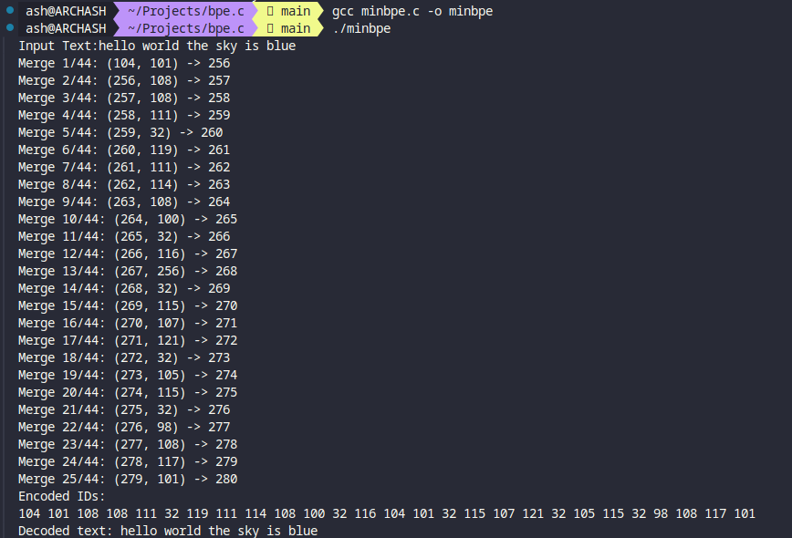

# bpe.c

bpe.c is a lightweight, minimal implementation of Byte Pair Encoding (BPE) in C.

### Features
- Implements Byte Pair Encoding algorithm
- Trains on input text to learn token merges
- Customizable vocabulary size
- Minimal dependencies (standard C libraries only)

### How It Works

- Initialization: The tokenizer starts with a basic vocabulary of 256 byte values.
- Training: It analyzes the input text, finding the most frequent pairs of tokens and merging them iteratively until the desired vocabulary size is reached.
- Encoding: Using the learned merges, it converts input text into a sequence of token IDs.
- Decoding: It can reconstruct the original text from a sequence of token IDs.

### Usage


You can easily customize the tokenizer by modifying the following constants in the file:

- <b>INITIAL_VOCAB_SIZE</b>: The starting vocabulary size (default is 256 for ASCII characters)
- <b>MAX_TEXT_SIZE</b>: The maximum length of text that can be processed

Modify the ```main``` function to experiment with different texts and vocabulary sizes.

```C
int main() {
    BasicTokenizer *tokenizer = create_tokenizer();
    
    const char *text = "hello world the sky is blue";
    size_t vocab_size = 300;

    train(tokenizer, text, vocab_size, 1);

    // Encode the text
    int ids[MAX_TEXT_SIZE];
    size_t ids_size = 0;
    encode(tokenizer, text, ids, &ids_size);
    
    // Decode the ids
    char decoded_text[MAX_TEXT_SIZE];
    decode(tokenizer, ids, ids_size, decoded_text);
    
    printf("Encoded IDs:\n");
    for (size_t i = 0; i < ids_size; ++i) {
        printf("%d ", ids[i]);
    }
    printf("\nDecoded text: %s\n", decoded_text);
    
    clean_tokenizer(tokenizer);

    return 0;
}
```

The result:


